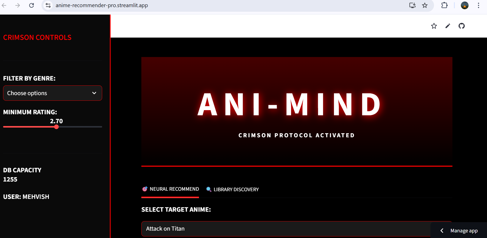
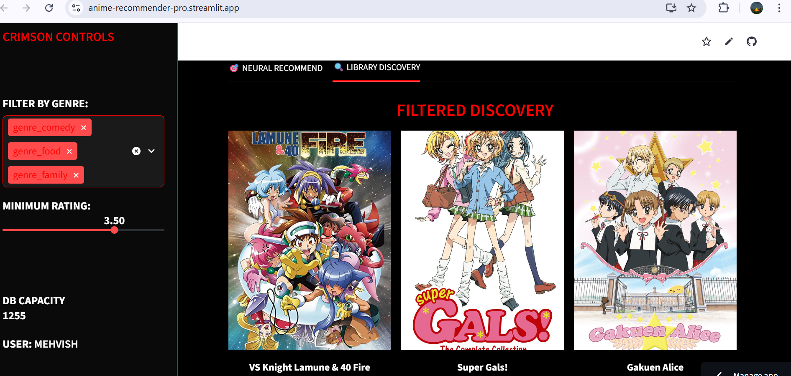
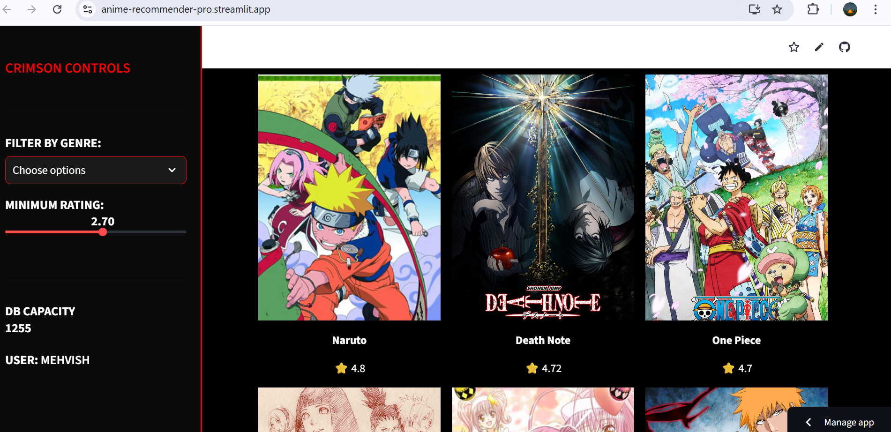

# 👹 ANI-MIND | Crimson Onyx Recommender
> **"Unlock your next obsession with the Crimson Protocol."**

[]
(https://anime-recommender-pro.streamlit.app/)

ANI-MIND is a professional **Anime Discovery Engine** that leverages **Machine Learning** to find deep connections between titles. Unlike simple popularity filters, ANI-MIND analyzes metadata vectors to suggest content that truly matches your taste.

---

## 📸 Interface Preview
## 📸 Interface Preview

### 🏠 Home Dashboard

*The Crimson Protocol main interface for neural anime selection.*

---

### 🔍 Discovery & Filtering
| Neural Search Results | Genre & Rating Filtering |
| :---: | :---: |
|  |  |
| *Deep content matching* | *Surgical genre precision* |



---

## ⚡ Core Functionalities
* **🎯 Neural Scan:** Utilizing **Cosine Similarity**, the engine calculates the "distance" between 1,200+ anime titles to recommend the top 9 matches for your selection.
* **🔍 Discovery Protocol:** A custom-built library browser that allows users to filter the entire database by **Genre** and **Rating** simultaneously.
* **🌑 Custom Onyx UI:** A bespoke Streamlit interface featuring a high-contrast dark mode with glowing crimson accents for a premium user experience.
* **📌 Top-Tier Priority:** Popular titles like *Attack on Titan*, *Naruto*, and *One Piece* are indexed at the top for instant accessibility.

---

## 🧠 How It Works (The Data Science)
The engine operates on a **Content-Based Filtering** model:
1. **Vectorization:** Anime metadata (Genres, Ratings, Descriptions) is transformed into a numerical feature matrix.
2. **Similarity Calculation:** We apply the **Cosine Similarity** formula to measure the angle between vectors:
   $$\text{similarity} = \cos(\theta) = \frac{A \cdot B}{\|A\| \|B\|}$$
3. **Retrieval:** When a user selects a title, the system identifies the vectors with the smallest "angular distance" and serves them as recommendations.

---

## 🛠️ Tech Stack
* **Language:** Python 3.10+
* **ML Libraries:** Scikit-Learn (Vectorization & Metrics)
* **Data Handling:** Pandas (Data Cleaning & Masking), NumPy
* **Frontend:** Streamlit (Custom CSS Injection)
* **Deployment:** Streamlit Community Cloud

---

## 📂 Project Architecture
```text
├── app.py                # Core Engine & Streamlit UI
├── requirements.txt      # Environment dependencies
├── README.md             # Professional Documentation
└── models/               
    ├── anime_list.pkl    # Pre-processed dataset (1,200+ titles)
    └── similarity_matrix.pkl  # Trained ML Similarity model